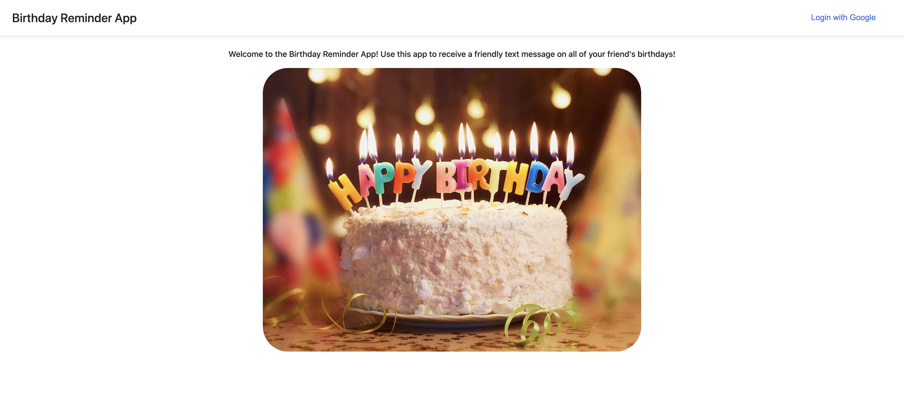
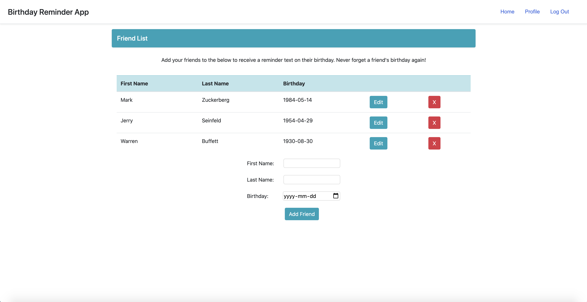

# Birthday Reminder App

This web application sends you a friendly text message to remind you of your friend birthday's. The app uses OAuth to register a user and allows one to input the name and birthday of their close friends and family. The app assumes a user logs in each day and uses Twilio API to send a reminder text message if it is a friend's birthday! Never forget a birthday again!

---

## Screenshots of the Application

### Login Page Screenshot

### Homepage Screenshot

---

## Technologies Used

- HTML
- CSS
- JavaScript
- Express
- Twilio API
- OAuth Authentification
- MongoDB

## Getting Started

https://birthday-reminder-app-sei.herokuapp.com/

## Next Steps

1. **Viewing other Users:** Adding a view option to see other users could give the app more functionality, and maybe help remind yourself of other friend's be sending your best wishes to.

2. **Twilio API:** Allowing users to receive text messages through the Twilio API without having to log in would increase the practicality of the application.

3. **Reminder Schedule:** Allowing users to receive text messages a day, or a week before a friend's birthday would be another function that could improve the usability of the app.
